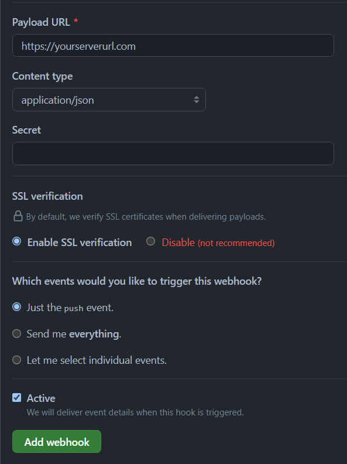
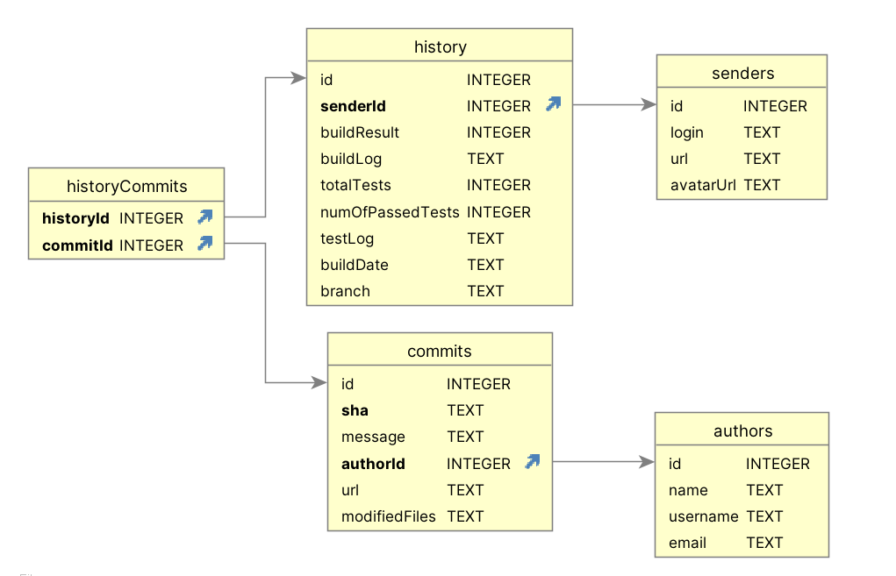

# lab2: Continuous Integration

This is a continuous integration server for Java projects that are using [Gradle](https://gradle.org/). It can be set up as a webhook for public GitHub repositories where it will build and test the program, then both report the result as a commit-status in GitHub and save the result for later access.

## Documentation 
JavaDoc for the package can be found in the JavaDoc folder in the repository. 

## Build and run
The server is built with Java 21 using Gradle. Follow these steps to compile the project: 

### With IDE
1. Set Java version to Java 21.
2. Add GitHub access token as environment variable `GITHUB_COMMIT_STATUS_TOKEN`.
3. Import into gradle-compatible IDE and run.

### In Terminal 
1. Set Java version to Java 21.
2. Add GitHub access token as environment variable `GITHUB_COMMIT_STATUS_TOKEN`
3. Run `./gradlew run` 

## How to use:
1. Setup GitHub to send webhooks to it. 
1. Add GitHub access token as environment variable `GITHUB_COMMIT_STATUS_TOKEN`
2. Build and run the server according to instructions above
   
The results from the build and tests will be set as the commit-status on GitHub of the last commit in the push. History of the builds can also be accessed in a web-browser at the servers URL. 

### GitHub Webhook setup: 
To setup the GitHub webhook go to your public repository, select settings and then Webhooks. Click Add webhook, enter the URL to where your server is hosted, select `application/json` as content type, let the Active box be checked and click Add Webhook. 

### GitHub Access token: 
Create a personal access token (classic) on GitHub in settings under developer settings. Name your token and fill the repository checkbox before creating the token. Add token as environment variable with the name `GITHUB_COMMIT_STATUS_TOKEN`.

### Web Interface 
CI HISTORY: [https://loving-perfectly-mako.ngrok-free.app](http://loving-perfectly-mako.ngrok-free.app)

Main page of the web interface display shows a list of all saved history. Each entry is a link to a pages displaying information about that build and tests. Each entry X is also accessible at `https://loving-perfectly-mako.ngrok-free.app/build_X/`. 

## Compilation and Test implementation
The compilation and testing of a given project is implemented [gradle's java tooling library](https://docs.gradle.org/current/javadoc/org/gradle/tooling/package-summary.html) for building and testing gradle projects. 

Our usage of these functions are done by having three test projects. One that compiles and passes all tests, one that compiles but fails the tests, and one that fails the builds. Our implementation has one unit test for each of these three projects, and it is asserted that the build results meets the expectations. 

## Notification implementation 
The notifications is delivered as commit-statuses on GitHub. They are implemented with REST API-calls to GitHub servers using personal access tokens (see how to use section). 

Unit testing of this feature is done by mocking the HttpClient with [Mockito](https://github.com/mockito/mockito). This allows us to verify that the API made to GitHubs server are as expected without any actual API calls being made. 

# Statement of Contributions:
All contributions of features and fixes includes accompanying tests.

#### Shared amongst the team
* Server listens to and parses webhook requests.
* Code reviews.
* Squash & Merges of pull requests. 

#### Douglas Fischer (DouglasFischer):
* Clone and cleanup repository.
* Feature integrations.
* Essence document.

#### Erik Winbladh (ractodev):
* GitHub commit status notification (Lead-author).
* History database with data access object (Co-author).
* History web interface.

#### Johan Norlin (Acuadragon100):
* Server builds projects.
* Server runs project tests. 
* Feature integrations. 

#### Robin Claesson (RobinClaesson):
* GitHub commit status notification (Co-author).
* History database with data access object (Lead-author).
* Feature integrations.
* README.md 

### Prideful Remark
The history is built with a SQLite database with multiple tables and an accompanying data access object (DAO). The DAO makes sure each sender and author is only added once to the database. The database can also handle the edge cases of a commit being part of two different pushes without duplicating the commit entry. 

